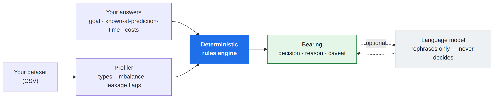
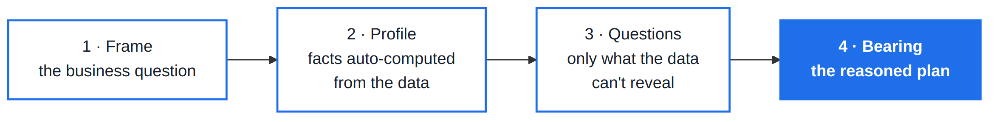
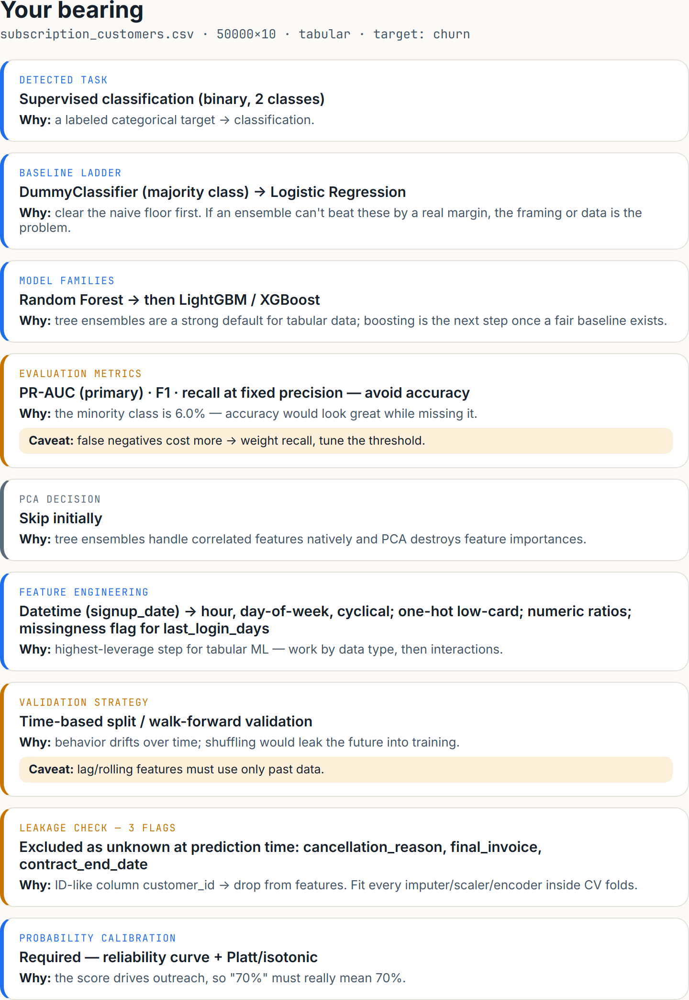
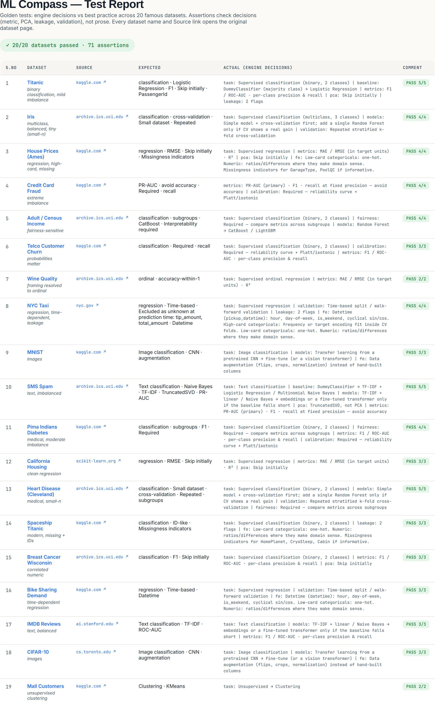

# The Most Expensive ML Mistakes Happen Before Training

*The worst ML failures usually aren't bad algorithms. They're leaked columns, the wrong success metric, and dishonest validation — decisions made in the first hour with a dataset, before a single model is trained. I built ML Compass as a deterministic second opinion for that hour.*

> **TL;DR** — The expensive ML mistakes happen *before* you train a model, and the no-code platforms rarely force the questions that catch them. ML Compass profiles your dataset, asks the few things the data can't answer, and returns a reasoned plan — task, metric, validation, and a leakage audit — with a *why* behind every call. Deterministic (rules decide, the LLM only rephrases), private (runs in your browser), open source, and regression-tested against 20 datasets.

I built a small working prototype here: **[ML Compass](https://venkatviswa.github.io/ml-compass)**. It follows a simple flow — frame the business decision, profile the dataset, answer a few context questions, then receive a deterministic *bearing* with reasons and caveats.

---

## The first hour with a new dataset

If you've ever consulted, you know this hour. A client drops a CSV on you — claims, transactions, customers, sensor readings — and within a day someone wants to know "can we predict X?" You open it, and a dozen decisions queue up immediately. What's the target, really? Is this classification or regression? Which columns will I actually *have* at prediction time? What does "good" even mean here — accuracy? recall? dollars?

Get those right and the modeling is almost boring. Get one wrong and you can spend two weeks building something that looks great in your notebook and falls apart in production — not because the model was weak, but because the *setup* was dishonest.

That's the problem I kept hitting, and the one I tried to solve.

## "Which model should I use" is the wrong question

It's the question everyone asks, and the least interesting one. For many tabular problems, the honest answer is often "start with a simple baseline, then try a strong tree ensemble." You can learn that in an afternoon.

The mistakes that actually cost you are quieter:

- **Data leakage.** You're predicting taxi fare and you leave `total_amount` and `tip_amount` in the features. The model is "98% accurate" because you handed it the answer — columns it will never have at prediction time.
- **The wrong metric.** Your fraud data is 0.2% positive. A model that predicts "never fraud" is 99.8% accurate and useless. Accuracy was the wrong yardstick from the start.
- **Dishonest validation.** The data is a time series, you shuffle it for cross-validation, and you quietly train on the future to predict the past. The score is a lie.
- **Sloppy framing.** A 1–5 satisfaction score isn't obviously classification *or* regression — it's ordinal, and treating it as either loses information. That's a judgment call, not something to infer silently.

None of these are model-selection problems. They're judgment problems, and they happen before you ever fit anything.

*(New to some of these terms? There's a plain-English glossary at the very end. You won't need it to follow along.)*

## The button got easier. The thinking didn't.

Here's the part I didn't expect to care about until I lived it.

The platforms most teams now use have made *training* a model dramatically easier. In Salesforce, **Einstein Model Builder** lets an admin build a predictive model with clicks. **Snowflake Cortex** and Snowflake ML train classification or forecasting models from a line of SQL. **Databricks AutoML** generates baseline models and notebooks automatically, and **Genie** answers data questions in plain language.

This is genuinely great — and ML Compass isn't a competitor to any of it. But notice what got automated and what didn't. These tools help enormously with the *mechanics* of training. What they rarely do is force the uncomfortable framing questions: *will this feature actually exist at prediction time? is accuracy meaningful when one class is rare? should this be split by time?* It's still easy to optimize for accuracy on a 2%-positive target and get a beautiful, misleading number. Those decisions are still on you, and they're where projects quietly fail.

So if you're a Salesforce architect who can stand up an Einstein prediction in your sleep but isn't steeped in *why* accuracy is the wrong success metric for a rare event — that gap is exactly the risk. ML Compass is meant to be the **pre-flight checklist you run before you press their Train button**: a reasoned second opinion, not another model.

## What I built: ML Compass

ML Compass takes a dataset and a one-line business goal and returns a *bearing* — a structured plan covering the task, baselines, model families, the right evaluation metric, a feature-engineering plan, a validation strategy, and a leakage audit. Every recommendation comes with a **decision, a reason, and a caveat**. A compass, not autopilot.

Three things make it different.

**1. Opinionated and reasoned — not a menu.** It doesn't hand you twelve options and wish you luck. It makes a call and tells you *why*, with the caveat that would change its mind. You don't just get an answer; you get reasoning you can carry to the next dataset.

**2. Rules decide; the model only explains.** This is the core, and the moat. The recommendation comes from a deterministic rules engine over your dataset's profile and your answers — *not* a language model's guess. An LLM is optional and does one job: rephrase the output into friendlier prose. It can never add, drop, or change a decision. That's the opposite of "ask ChatGPT which model to use," which gives a confident answer with no way to know if it's right. Deterministic means **auditable, reproducible, and testable**.

**🖼️ IMAGE 1 of 4 — upload `diagram-architecture.png` here**

*The rules engine makes every call. The language model, if enabled, only rewords the output.*

**3. Private, runs locally.** The dataset never leaves your browser. For consulting work on a client's data, that's not a nice-to-have — it's the difference between "I can use this" and "legal said no."

## What it isn't (and what it can't do)

It's an advisor, not an AutoML tool. It doesn't train a model or touch your warehouse — it produces the *plan and the reasoning* you take *into* Model Builder, Cortex, Databricks, or a notebook.

And to be honest about the limits: ML Compass advises, it doesn't guarantee. It won't tell you whether your problem is worth solving, replace domain or clinical review, or certify a model as fair or correct. It gets you to a defensible starting point faster and flags the common traps. The judgment stays yours.

## How it works

**🖼️ IMAGE 2 of 4 — upload `diagram-flow.png` here**

Four steps, about two minutes:

1. **Frame** — one line about the decision this prediction will drive, then drop in a CSV (or use the built-in sample).
2. **Profile** — the app computes everything objective: column types, cardinality, missingness, class imbalance, ID-like and leak-suspect columns, and whether the data even looks tabular.
3. **Questions** — it asks only what the data *can't* tell it (about five taps): time-dependence, whether you need probabilities, regulated/high-stakes, interpretability, error cost, and — the most valuable one — *which columns you'd actually know at prediction time*.
4. **Bearing** — the rules engine emits the plan, each section with its decision, reason, and caveat.

## What it looks like on a real dataset

A SaaS company hands you a customer export and asks the classic question: predict who will cancel so the retention team can step in. Forty-odd columns and a tidy `churn` flag. The obvious move is to load it into Einstein Model Builder (or Databricks AutoML), set the goal to `churn`, optimize accuracy, and ship.

Here's the bearing ML Compass returns instead — same dataset, the three after-the-fact columns set aside as "won't know at prediction time":

**🖼️ IMAGE 3 of 4 — upload `screenshot-bearing.png` here**

**How to read it.** Each card is a *decision*, the *why*, and a *caveat* where one applies. Top to bottom it's a plan: what kind of problem this is, what to try first, what to measure, how to validate, and — the part that saves you — what to leave out. The leakage check is the headline: `cancellation_reason`, `final_invoice`, and `contract_end_date` only exist *because* a customer already churned. Leave them in and you score 97% by reading the answer off the back of the card.

**Your next step.** The plan drops straight into whatever you build with:

1. **Drop the leaks** — remove `customer_id` and the three after-the-fact columns first.
2. **Set the right metric** — PR-AUC or recall-at-precision, not accuracy (the "goal" you pick in Model Builder; the scoring function in a notebook).
3. **Split by time** — train on earlier customers, validate on later ones. No random shuffle.
4. **Start simple** — logistic baseline, then gradient boosting, and keep the complex model only if it clears the baseline by a real margin.
5. **Calibrate before you rank** — so the retention team can trust a "70% risk."

Now take the same idea somewhere higher-stakes — a clinic predicting which patients are at risk for diabetes. The advice shifts on its own: because a wrong call affects a person, it flags the problem as **high-stakes** and recommends checking performance *across subgroups* (does it do worse for an age band or sex?) and leaning on interpretable models you can defend. A risk score used for triage **must be calibrated**. Missing an at-risk patient is the costly error, so it weights **recall**. And it catches the quiet data problems — a lab value recorded only *after* diagnosis is leakage; an impossible glucose reading of 0 is a missing value masquerading as data.

In both cases the tool trained nothing. It told you which problem you're really solving, and where you were about to fool yourself.

## Determinism you can prove

Because the engine is deterministic, I can do something you can't do with an LLM advisor: **write tests.** I encoded 20 famous datasets — Titanic, Credit Card Fraud, Adult Income, NYC Taxi, MNIST, SMS Spam, and more — as fixtures, each asserting the engine's *decisions* against best practice. Extreme imbalance must yield PR-AUC, not accuracy. A time-dependent target must yield a time-based split. A leaked column must get flagged.

**🖼️ IMAGE 4 of 4 — upload `screenshot-test-report.png` here**

Twenty datasets, seventy-one assertions, zero failures — and when I add a rule, the suite tells me immediately if I broke an old one. The point isn't that the rules are perfect; it's that they're **explicit enough to challenge, improve, and regression-test**. Disagree with a call? It's a line of code and a test, not a vibe. That's the whole philosophy in one artifact: if a recommendation can't be tested, I don't trust it — and neither should you.

## Who this is for

Analysts, architects, admins, and data teams who are comfortable in AutoML or a notebook but want a structured sanity check before they model. It isn't trying to replace a data scientist — it's trying to make the first modeling conversation more defensible.

## Try it

ML Compass is open source and runs free, entirely in your browser — nothing leaves your machine. Point it at your next dataset *before* you click Train. Try it on Titanic, the credit-card fraud set, a churn export, or your own CSV, and see whether the bearing matches your instinct — or catches something you'd have missed.

**Try the prototype: [venkatviswa.github.io/ml-compass](https://venkatviswa.github.io/ml-compass)**
**Read the rules and tests: [GitHub repo](https://github.com/venkatviswa/ml-compass)**

AutoML made training easier. ML Compass is my attempt to make the step *before* training harder to get wrong.

---

## Plain-English glossary for non-ML specialists

- **Target** — the thing you're predicting (will this customer churn? is this patient at risk?).
- **Classification vs. regression** — classification predicts a *category*; regression predicts a *number*. **Ordinal** is the in-between: ordered categories like a 1–5 rating, where the order matters.
- **Baseline** — a deliberately dumb model (always guess the majority, or the average) you must beat. If your fancy model can't, something's wrong with the setup.
- **Data leakage** — when a feature secretly contains the answer, or information you wouldn't have at prediction time. Makes a model look brilliant in testing and useless in the real world. The classic tell: a column filled in only *after* the event you're predicting.
- **Class imbalance** — when one outcome is rare (6% churn, 0.2% fraud). It quietly breaks "accuracy" as a measure.
- **Accuracy / precision / recall** — accuracy is "how often right overall" (misleading when a class is rare). Precision: "when it says yes, how often is it right." Recall: "of all the real yeses, how many did it catch." Catching churners is recall; not wasting outreach is precision.
- **PR-AUC / ROC-AUC / F1** — single-number scores summarizing precision and recall. **PR-AUC** is often more informative for rare events; ROC-AUC and F1 can still be useful, but they answer different questions.
- **Cross-validation** — instead of one train/test split, rotate through several so the score isn't a fluke of how you split.
- **Time-based split (walk-forward)** — for data that changes over time, train on the past and test on the future, never the reverse. Shuffling time is a subtle leak.
- **Calibration** — making the predicted probability *mean* something: among cases called "70%," about 70% should actually happen. Essential when you rank or triage by the score.
- **Feature engineering** — turning raw columns into more useful signals (a timestamp → hour-of-day, day-of-week; two columns → their ratio).
- **PCA** — compresses many correlated columns into fewer. Useful for some models, usually unnecessary for tree ensembles.
- **SHAP / interpretability** — methods that explain *why* a model made a prediction — important when a human or regulator must trust it.
- **Subgroup evaluation** — checking the model performs fairly across groups (age, sex, region), not just on average. Critical in regulated and healthcare settings.
