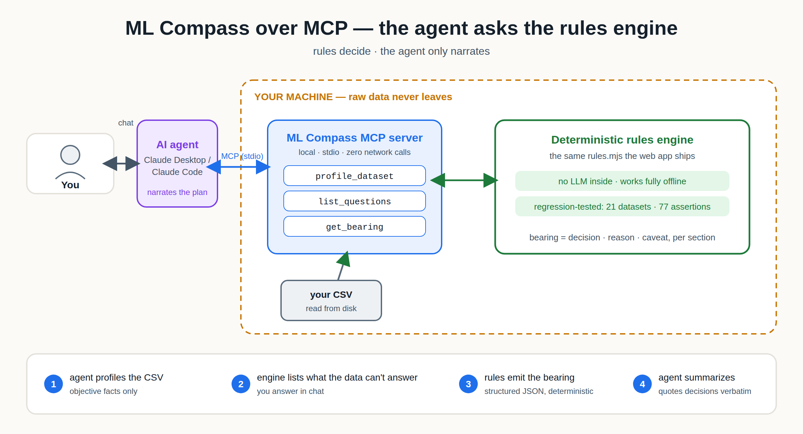

# ML Compass as an MCP Server — Setup Guide

ML Compass exposes its deterministic rules engine over the
[Model Context Protocol](https://modelcontextprotocol.io), so AI agents (Claude
Desktop, Claude Code, or any MCP client) can consult it instead of guessing which
model to use. The agent handles the conversation; **every decision comes from the
same rules engine the web app ships** — there is no LLM inside either server.



Two modes:

| | **Local (stdio)** — `mcp/server.mjs` | **Remote (Cloudflare Worker)** — `mcp-worker/` |
|---|---|---|
| Where it runs | your machine | your Cloudflare account |
| Data | reads CSVs from **your disk** — nothing leaves the machine, zero network calls | accepts only the **computed profile + task facts** — raw rows are structurally impossible to send |
| Tools | `profile_dataset`, `list_questions`, `get_bearing` | `list_questions`, `get_bearing` |
| Best for | day-to-day use, sensitive data, offline work | agents that already hold a dataset's facts; zero-install URL |

---

## Local server

### Prerequisites

- **Node.js 20+** — check with `node -v`. If you get `command not found` (or any
  `env: node: No such file or directory` error later), Node isn't installed:
  grab the LTS installer from [nodejs.org](https://nodejs.org) or `brew install node`.

### Install

```bash
git clone https://github.com/venkatviswa/ml-compass.git
cd ml-compass
npm install          # pulls the MCP SDK; @mlc-ai/web-llm is optional and unrelated here
npm run test:mcp     # sanity check: 11 end-to-end checks over real JSON-RPC should pass
```

### Hook it up to Claude Code

```bash
cd ml-compass
claude mcp add ml-compass -- node "$(pwd)/mcp/server.mjs"
# add --scope user before the name to make it available in every project
claude mcp list      # should show ml-compass
```

### Hook it up to Claude Desktop

Settings → Developer → Edit Config, then add (use **absolute paths** — Desktop
launches outside your shell, so `~` and PATH tricks don't apply; if you installed
Node via Homebrew on Apple Silicon, use `/opt/homebrew/bin/node` as the command):

```json
{
  "mcpServers": {
    "ml-compass": {
      "command": "node",
      "args": ["/absolute/path/to/ml-compass/mcp/server.mjs"]
    }
  }
}
```

### Try it

Grab a classic dataset:

```bash
curl -sSL -o ~/titanic.csv https://raw.githubusercontent.com/datasciencedojo/datasets/master/titanic.csv
```

Then prompt your agent:

> Use ml-compass to profile ~/titanic.csv, ask me the questions it needs,
> then get the bearing for target `Survived` and summarize the plan.

The agent will chain `profile_dataset` → `list_questions` → interview you →
`get_bearing`, and land on: binary classification, Dummy → Logistic Regression
baseline, F1/ROC-AUC, stratified k-fold, and leakage flags on `PassengerId`/`Name`.
For unsupervised data, just omit the target ("there's no target column; I want
customer segments") — the engine asks one question (cluster / reduce / anomaly)
and returns the matching plan.

### What you should see (real output, abridged)

`list_questions` — Titanic's `Survived` is numeric 0/1, so the engine refuses to
assume classification and asks; note the warning that the question set grows:

```json
{
  "task": { "kind": "regression", "targetType": "ordinal",
            "framingAmbiguous": true, "nClasses": 2, "imbalance": 0.384 },
  "questions": [
    { "key": "framing",
      "question": "The numeric target has few distinct values — model it as regression, classification, or ordinal?",
      "options": ["regression", "classification", "ordinal"], "answered": false },
    "… timeDependent, interpretability, regulated …"
  ],
  "note": "If framing is answered \"classification\", these questions ALSO apply: needsProbs, errorCost. Re-call list_questions with your answers to get the final set before get_bearing."
}
```

`get_bearing` (answers: classification, probabilities needed, equal error cost;
excluded `PassengerId`, `Name`, `Ticket`) — every section is decision · reason ·
caveat, and the top-level `note` tells the agent to quote decisions verbatim:

```json
{
  "note": "Every decision below came from deterministic rules over the dataset profile and the answers — not from a language model. When summarizing for the user, quote each section's decision verbatim (do not substitute metrics or model names); only the reasons may be paraphrased.",
  "sections": [
    { "id": "task",     "decision": "Supervised classification (binary, 2 classes)",
      "reason": "A labeled categorical target → classification." },
    { "id": "metrics",  "decision": "F1 / ROC-AUC · per-class precision & recall",
      "reason": "Reasonably balanced classes; standard classification metrics apply." },
    { "id": "leakage",  "decision": "2 flags",
      "reason": "Excluded as unknown at prediction time: PassengerId, Name, Ticket. Fit every imputer, scaler and encoder inside CV folds." },
    { "id": "calibration", "decision": "Required — reliability curve + Platt/isotonic",
      "reason": "Outputs are used as scores, so the probability itself must be trustworthy.",
      "caveat": "Check Brier score alongside the curve." },
    "… baseline, models, pca, fe, validation …"
  ]
}
```

And if the agent skips relevant questions (say it never asked about probabilities),
the response says so instead of assuming silently:

```json
"unansweredQuestions": {
  "keys": ["needsProbs", "errorCost"],
  "note": "These questions were relevant but unanswered — the bearing assumes defaults. Answer them (see list_questions) for a sharper bearing."
}
```

### Poking at it directly (optional)

The MCP Inspector gives you a browser UI to call tools by hand:

```bash
npx @modelcontextprotocol/inspector node mcp/server.mjs
```

### The tools

| Tool | Input | Returns |
|---|---|---|
| `profile_dataset` | `path` (local CSV) or `csv` (content) | per-column dtype, cardinality, missing %, ID-like flags, modality hint |
| `list_questions` | source + optional `target`, `answers` | the questions the data can't answer, with allowed values. If the target's framing is ambiguous, a `note` warns that answering "classification" adds `needsProbs`/`errorCost` — re-call to get the final set |
| `get_bearing` | source + `target`, `answers`, `excludedCols` | the full bearing (sections of decision · reason · caveat). Includes `unansweredQuestions` if relevant questions were skipped, and a note instructing agents to quote decisions verbatim |

`excludedCols` deserves emphasis: list every column that would **not** be known at
prediction time. It's the single most valuable leakage guard the engine has.

---

## Remote server (Cloudflare Worker)

Deploys separately from the Pages site:

```bash
cd mcp-worker
npm install
npx wrangler deploy      # first run opens a browser login
```

You'll get `https://ml-compass-mcp.<account>.workers.dev`. Point MCP clients at
**`/mcp`** (streamable HTTP) or **`/sse`** (legacy SSE), e.g.:

```bash
claude mcp add --transport http ml-compass-remote https://ml-compass-mcp.<account>.workers.dev/mcp
```

The remote tools take the **computed profile** (from `profile_dataset` locally, or
the web app) — by design there is no way to send raw rows to it.

---

## Troubleshooting

- **`env: node: No such file or directory`** — Node isn't installed or isn't on the
  spawning process's PATH. Install Node (above); for Claude Desktop use the absolute
  node path as `command`.
- **Server "does nothing" when run by hand** — correct: `node mcp/server.mjs` sits
  silently waiting for JSON-RPC on stdin. Ctrl+C to exit. If it prints a module
  error instead, run `npm install` first.
- **Changes not taking effect after `git pull`** — the stdio server is spawned once
  per client session and stays in memory. Restart the Claude session (or reconnect
  via `/mcp`) after pulling.
- **The agent asked only 4 questions at once** — that's the client's question-UI
  cap, not the server; agents split into two rounds on their own.
- **Verify the server itself in one command** — `npm run test:mcp` (drives the real
  server over stdio; all 11 checks should pass).
